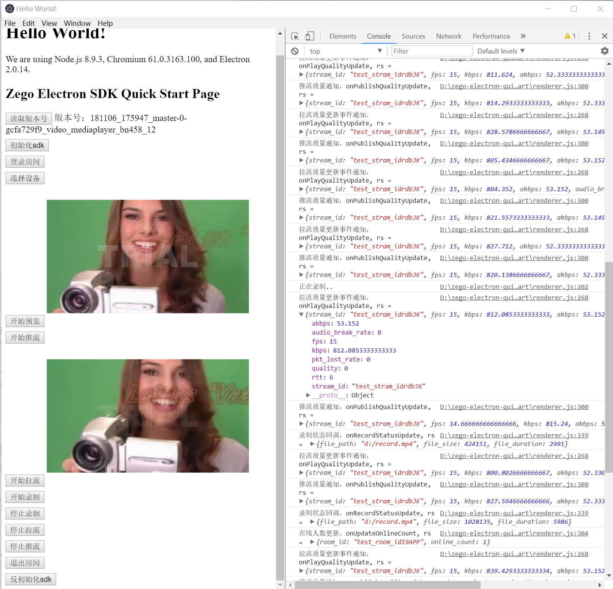

# zego-electron-quick-start 

1. 安装好node 32位环境。[https://nodejs.org/dist/v10.14.1/node-v10.14.1-x86.msi](https://nodejs.org/dist/v10.14.1/node-v10.14.1-x86.msi)
2. 按照以下命令执行。

## 执行以下命令，下载工程源码
```
$ git clone https://github.com/zegoim/zego-electron-quick-start.git
```

## 进入`zego-electron-quick-start`目录
```
$ cd zego-electron-quick-start
```

## 先配置淘宝镜像，并安装依赖，命令如下
```
$ npm config set registry http://registry.npm.taobao.org/
$ npm install
```
## 如果使用淘宝镜像，npm install安装依赖时失败了，请切换到国外镜像，并设置通过代理访问，设置方法如下

+ 设置国外镜像，并通过代理访问国外镜像的方法是，执行以下命令
```
$ npm config set registry https://registry.npmjs.org/
  // 设置代理
$ npm config set proxy http://127.0.0.1:1080
  // 设置https代理
$ npm config set https-proxy http://127.0.0.1:1080
```
## 如果使用国外镜像，npm install安装依赖时失败了，请切换到国内淘宝镜像，设置方法如下
+ 设置npm淘宝镜像的方法是，执行以下命令
```
$ npm config set registry http://registry.npm.taobao.org/
  // 删除http代理
$ npm config delete proxy
  // 删除https代理
$ npm config delete https-proxy
```

<div STYLE="page-break-after: always;"></div>

## 修改填写`renderer.js`的第10行的 app_id 和 sign_key。
```
// app id，
// 在zego 控制台https://console.zego.im/acount 
// 注册后，获取app id，ID为整形或者字符串均可
const app_id = ; 
// app key，是一个数组，格式例如 [0x01, 0x03, 0x44, ....]
const sign_key = [];
```

## 运行测试程序
```
$ npm start
```

## 打包发布测试程序
```
mac 平台打包，不使用签名时使用以下命令禁止
$ export CSC_IDENTITY_AUTO_DISCOVERY=false
```
```
$ npm run pkg
```

## 执行成功后，`dist`目录下生成

* 安装包文件：
`zego-electron-quick-start Setup 1.0.0.exe`

* 未打成安装包的可执行文件目录：
`win-ia32-unpacked`

<div STYLE="page-break-after: always;"></div>

# 要在自己项目中集成zego sdk的步骤

1. 安装zego sdk
```
$ npm install zegoliveroom
```
2. 在工程项目中的renderer.js文件中添加以下代码，引入zego sdk，[参考代码 ](https://github.com/zegoim/zego-electron-quick-start//blob/master/renderer.js#L5)
```
var ZegoLiveRoom = require("zegoliveroom/ZegoLiveRoom.js");
var ZEGOCONSTANTS = require("zegoliveroom/ZegoConstant.js");
```
3. 创建zego client，[参考代码 ](https://github.com/zegoim/zego-electron-quick-start//blob/master/renderer.js#L14)
```
var zegoClient = new ZegoLiveRoom();
```
4. 配置当前环境，[参考代码 ](https://github.com/zegoim/zego-electron-quick-start//blob/master/renderer.js#L63)
```
  // 配置设置当前环境为测试环境
  zegoClient.setUseEnv({ use_test_env: true });
```
5. 初始化sdk，[参考代码 ](https://github.com/zegoim/zego-electron-quick-start//blob/master/renderer.js#L66)
```
  // 初始化sdk
  let ret = zegoClient.initSDK({
    app_id: app_id,           // appid
    sign_key: sign_key,       // app key
    user_id: TEST_USER_ID,    // 用户id
    user_name: TEST_USER_NAME // 用户名字
  }, rs => {
    if (rs.error_code == 0) {
      console.log("sdk初始化成功");
    } else {
      console.log("sdk初始化失败,错误码为：" + rs.error_code);
      zegoClient.unInitSDK();
    }
  });
  if (ret) {
    console.log("正在初始化...");
  } else {
    console.log("sdk初始化失败");
    zegoClient.unInitSDK();
  }
```
6. 登录房间，[参考代码 ](https://github.com/zegoim/zego-electron-quick-start//blob/master/renderer.js#L91)
```
  // 登陆房间
  let ret = zegoClient.loginRoom({
    room_id: TEST_ROOM_ID,                    // 房间id
    room_name: TEST_ROOM_NAME,                // 房间名字
    role: ZEGOCONSTANTS.ZegoRoomRole.Audience // 房间角色
  }, rs => {
    console.log("登录结果返回 ", rs);
    if (rs.error_code == 0) {
      console.log("登录成功");
    } else {
      console.log("登录失败，错误码为：" + rs.error_code);
    }
  });
```

7. 选择设备，[参考代码](https://github.com/zegoim/zego-electron-quick-start//blob/master/renderer.js#L105)
```
  // 获取摄像头设备列表
  let video_devices_list = zegoClient.getVideoDeviceList();
  console.log("got video devices list:", video_devices_list);
  if(video_devices_list.length > 0){
    let cur_sel_index = 0; // 设备索引，选择第一个设备
    zegoClient.setVideoDevice({
      device_id: video_devices_list[cur_sel_index].device_id 
    });
  }
```

8. 预览摄像头，[参考代码 ](https://github.com/zegoim/zego-electron-quick-start//blob/master/renderer.js#L121)
```
  // 设置预览view
  let set_ret = zegoClient.setPreviewView({
    // 设置canvas
    canvas_view: document.getElementById("localVideo"),
    // 通道索引，默认主通道
    channel_index: ZEGOCONSTANTS.PublishChannelIndex.PUBLISH_CHN_MAIN
  });
  if (set_ret) {
    // 开始预览 
    let preview_ret = zegoClient.startPreview({
      channel_index: ZEGOCONSTANTS.PublishChannelIndex.PUBLISH_CHN_MAIN
    });
    console.log("预览结果", preview_ret);
  }
```

9. 开启回音消除、噪音消除和增益，[参考代码 ](https://github.com/zegoim/zego-electron-quick-start//blob/master/renderer.js#L132)

```
    // 开启回音消除
    zegoClient.enableAEC({enable:true});
    // 开启噪音消除
    zegoClient.enableANS({enable:true});
    // 开启自动增益控制
    zegoClient.enableAGC({enable:true});
```

10. 开始推流，发送音视频数据，[参考代码 ](https://github.com/zegoim/zego-electron-quick-start//blob/master/renderer.js#L144)
```
  // 开始推流
  let ret = zegoClient.startPublishing({
    title: "zego electron simple test xx",// 推流标题
    stream_id: TEST_PUB_STREAM_ID,// 推流id
    // 推流flag，连麦、混流还是单主播
    publish_flag: ZEGOCONSTANTS.ZegoPublishFlag.ZEGO_JOIN_PUBLISH, 
    params: ""// 推流参数
  });
```

11. 开始拉流，播放音视频数据，开发过程中，需要传递的流id参数是对方的流id，这里为了演示，拉取的是自己的流id。[参考代码 ](https://github.com/zegoim/zego-electron-quick-start//blob/master/renderer.js#L156)
```
 // 开始拉流播放
  zegoClient.startPlayingStream({
   stream_id: TEST_PLAY_STREAM_ID,                      // 拉流id
   canvas_view: document.getElementById("remoteVideo"), // 设置播放的canvas
   params: ""                                           // 拉流参数
  });
```
<div STYLE="page-break-after: always;"></div>

12. 停止拉流播放音视频数据，[参考代码 ](https://github.com/zegoim/zego-electron-quick-start//blob/master/renderer.js#L164)
```
  zegoClient.stopPlayingStream({ 
    stream_id: TEST_PLAY_STREAM_ID  // 流id
  });
```

13. 停止推流发送音视频数据，[参考代码 ](https://github.com/zegoim/zego-electron-quick-start//blob/master/renderer.js#L214)
```
  zegoClient.stopPublishing({
       // 通道
       channel_index: ZEGOCONSTANTS.PublishChannelIndex.PUBLISH_CHN_MAIN 
  });
```
14. 退出房间，[参考代码 ](https://github.com/zegoim/zego-electron-quick-start//blob/master/renderer.js#L219)
```
  zegoClient.logoutRoom(rs => { });
```
15. 反初始化sdk，[参考代码 ](https://github.com/zegoim/zego-electron-quick-start//blob/master/renderer.js#L224)
```
  zegoClient.unInitSDK();
```
16. 生产环境中，不打开调试栏，关闭方法为，注释掉main.js的第18行代码，[mainWindow.webContents.openDevTools()](https://github.com/zegoim/zego-electron-quick-start//blob/master/main.js#L18)

17. 更多的功能接口和触发通知事件，请查阅工程demo示例和 [官网SDK](https://doc.zego.im/CN/307.html) 的[ Electron API接口](https://doc.zego.im/API/ZegoLiveRoom/Electron/html/index.html)文档。

28. **注意点说明**
-  推流和拉流：Zego SDK 把采集我方的音视频，编码后发送到 Zego 实时网络，此步骤被称为“推流”。同时，Zego SDK 从 Zego 实时网络中接收对方的音视频数据流，解码得到对方的声音与画面，此步骤被称作“拉流”。通话双方各自推我方流和拉对方流，视频通话就建立起来了。
- 用户id设置：业务保证唯一即可。
- 推流时机：登陆房间成功后，在进行推流操作。
- 拉流时机：在实现过程中，拉取的是对方的流，所以拉流操作传递的流id参数是对方的流id。在onStreamUpdated事件的流新增事件时可以获取到对方的流id。当收到新增流事件时在进行拉流操作。
- 房间登录相关说明，查看官网[房间登录](https://www.zego.im/html/document/#Application_Scenes/FAQ/Login)。
<div STYLE="page-break-after: always;"></div>

## 如何下载指定版本Electron 的 ZEGO LiveRoomSDK

在自己项目中的package.json文件，添加以下内容(其中4.0.8 表示对应的Electron版本号)。然后执行npm install

```
  "scripts": {
    "postinstall": "node node_modules/zegodown/bin/zegodown  -v 4.0.8"
  },
  "dependencies": {
    "zegoliveroom": "latest",
    "zegodown": "latest"
  }
```

如果指定下载32位,postinstall配置为
node node_modules/zegodown/bin/zegodown  -v 4.0.8 -a ia32

如果指定下载64位
node node_modules/zegodown/bin/zegodown  -v 4.0.8 -a x64

如果不指定，默认取值为node的os.platform()平台信息

mac 下不支持32位，默认为64位。

下载的Zego Electron Sdk 会自动解压放在node_modules/zegoliveroom目录下

目前支持指定以下版本Electron

['2.0.18', '3.0.16', '3.1.13', '4.0.8', '4.1.5', '4.2.11', '5.0.11']


版本说明：

由于Electron 的版本管理规则是从2.0开始符合semver规范：

规范大概是这样的：

版本号由3个数字组成：a.b.c

前面两个数字表示大小版本号的更新，数字a和b发生变化是，都会导致abi的不兼容，但是c的变化只是bug修改，不涉及abi的兼容问题。

例如：

可以通过以下命令查询到目前所有的Electron版本号。

```
npm view electron versions
```

用以上命令可以看到Electron的2.0版本有：2.0.0到2.0.18，目前Electron的2.0版本最高版本是2.0.18。那么ZEGO 就会对2.0.18进行支持，

所以使用ZEGO的2.0.18版本的sdk就能兼容Electron的2.0.0到2.0.18的任何一个版本。以此类推：

以此类推，目前ZEGO能默认支持2.0 到 5.0 的所有Electron版本，用户根据相关的版本号进行配置下载即可。


## 工程运行后，界面如下



